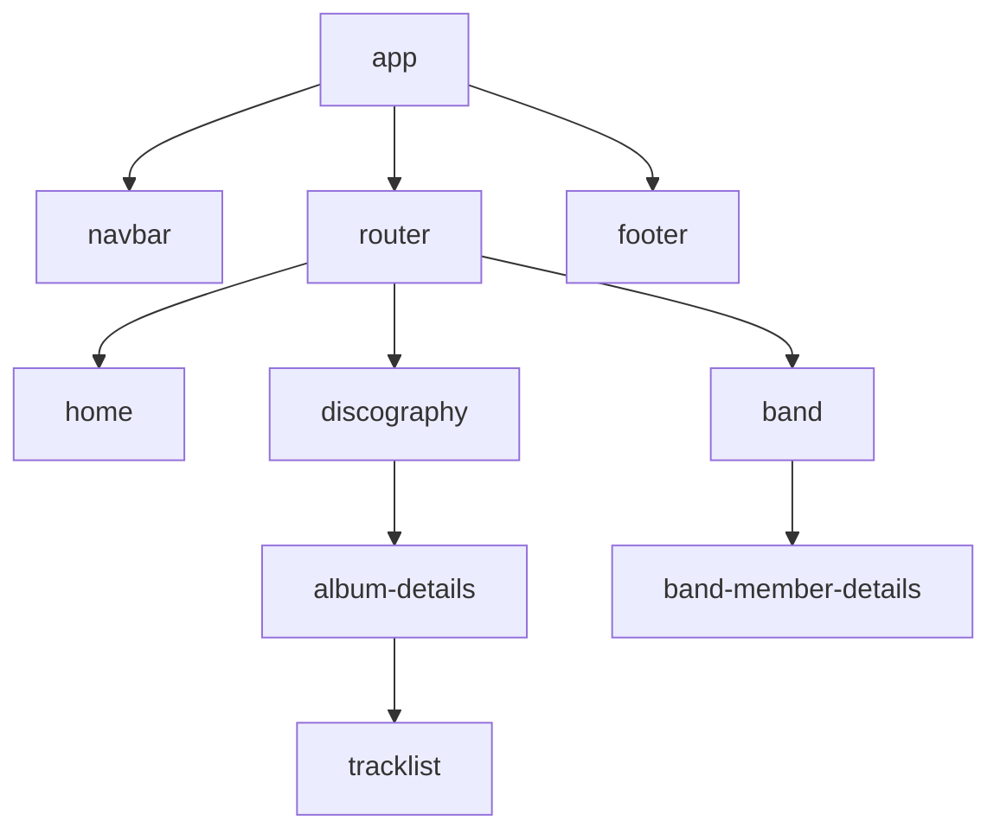

# SPA Música

Projeto relacionado a atividade do bootcamp T-Academy para fins didáticos.\
Foi proposta a criação de uma página relacionada a música, e escolhi a banda Dream Theater para esse projeto.

[print home]

[print discografia]

[print detalhe album]

[print banda]

[print detalhe membro banda]

## Tecnologias
- Angular
- TypeScript
- Tailwind

## Executando a aplicação

```shell
git clone git@github.com:paulohenrique-gh/angular-spa-dream-theater.git
```

```shell
cd angular-spa-dream-theater
```

```shell
npm install
```

Após isso é necessário iniciar o servidor do Angular e o do json-server

```shell
ng serve
```

```shell
npx json-server db.json
```


## Hierarquia básica dos componentes

