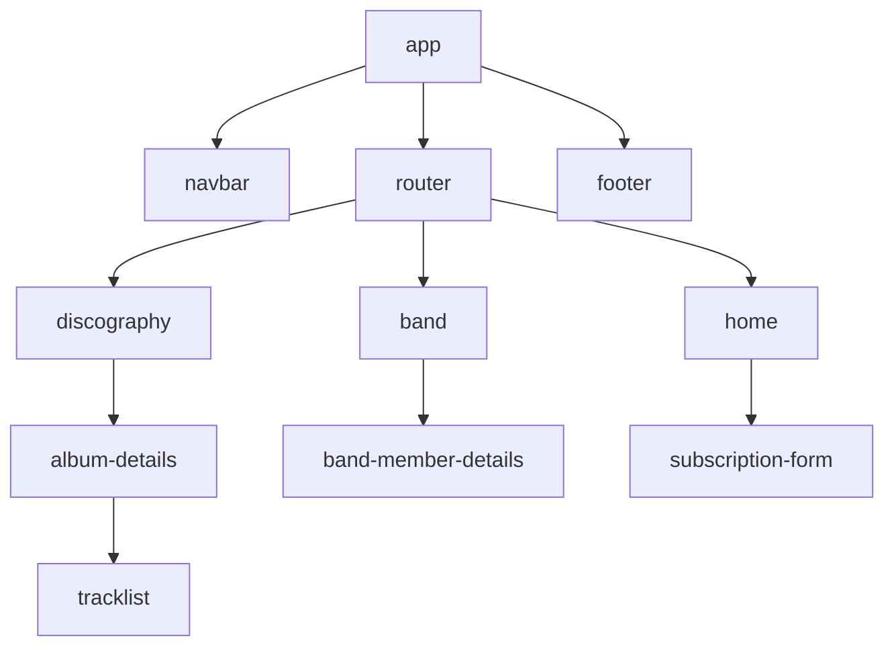

# SPA Música

Projeto relacionado a atividade do bootcamp T-Academy para fins didáticos.\
Foi proposta a criação de uma página relacionada a música, e escolhi a banda Dream Theater para esse projeto.


Home
---
<br>


Discografia
-
<br>


Detalhes de um álbum
-
<br>


Integrantes da banda
-
<br>


Detalhes de um integrante
-

## Tecnologias
- Angular
- TypeScript
- Tailwind

## Executando a aplicação

```shell
git clone git@github.com:paulohenrique-gh/angular-spa-dream-theater.git
```

```shell
cd angular-spa-dream-theater
```

```shell
npm install
```

Após isso é necessário iniciar o servidor do Angular e o do json-server

```shell
ng serve
```

```shell
npx json-server db.json
```


## Hierarquia básica dos componentes


